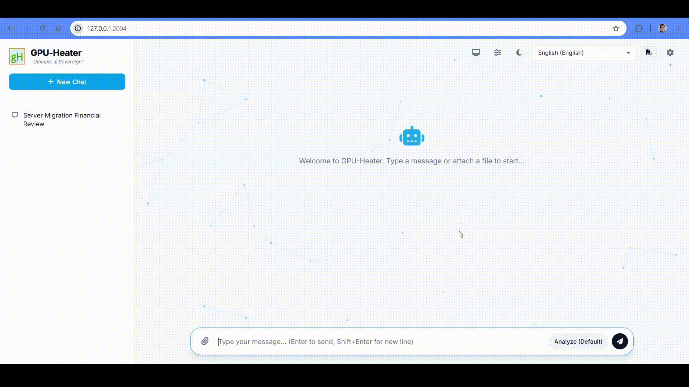
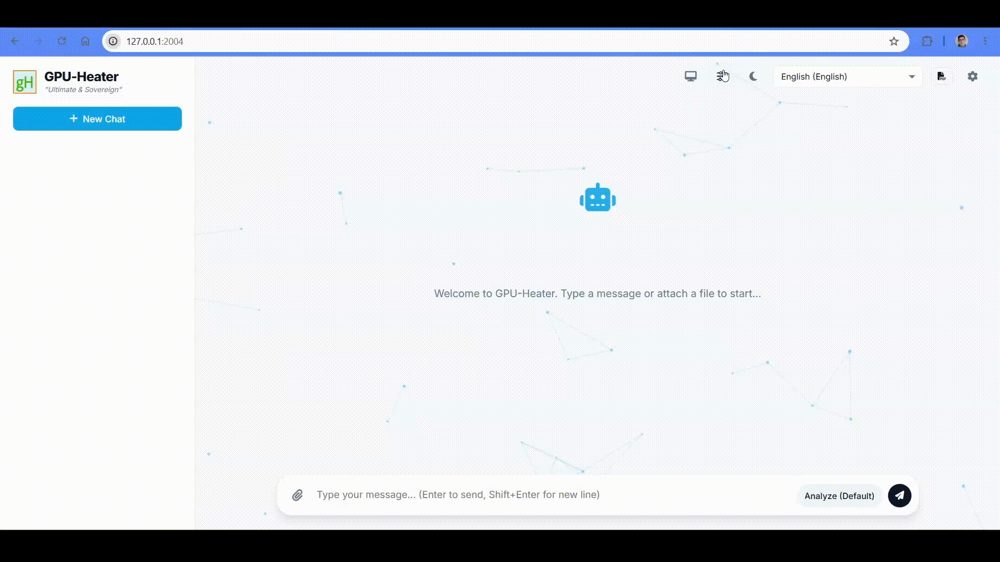
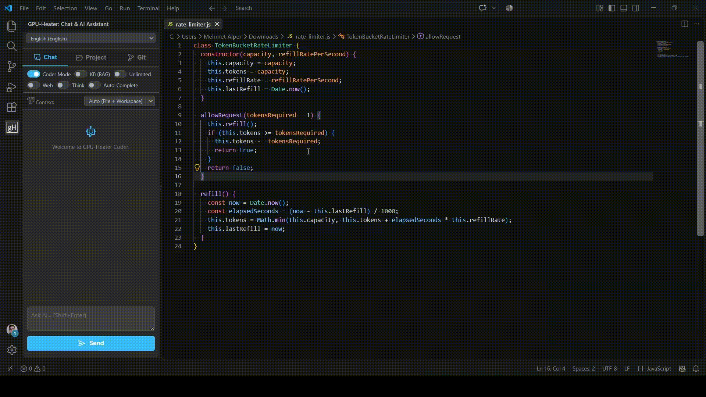

# GPU-Heater: Your Private, All-in-One Local AI Workspace

Turn your idle VRAM into a productivity powerhouse—and maybe generate a little room heat in the process. GPU-Heater is a privacy-first, multimodal AI platform that unifies text, code generation, vision analysis, video synthesis, audio, and 3D modeling into a single intuitive interface. Built on local execution engines like **Ollama** and **ComfyUI**, it provides an end-to-end AI hub that runs entirely on your local machine, keeping your data strictly on-premise.

<p align="center">
  
</p>

> ⚠️ **Development Notice:**  
> **GPU-Heater is currently in active development (Alpha v0.1.0).**  
> We have primarily verified this build on Windows and macOS. Hardware behaviors can vary across different setups—feel free to **[open an Issue](../../issues)** for hardware compatibility reports, log submissions, and bug feedback!

---

### ⚠️ Hardware Expectations & System Optimization

* **A Personal Sandbox:** GPU-Heater is engineered specifically for homelabs and single-user environments, not concurrent enterprise queues. To protect consumer-grade GPUs from Out-of-Memory (OOM) errors, the architecture employs a strict global hardware lock. When you trigger heavy visual or audio workflows, large language models are actively unloaded from VRAM and restored automatically when execution completes.
* **The "Heater" Reality & Performance:** Running high-parameter models (such as 32B architectures) on consumer hardware (e.g., a 12GB RTX 4070) requires intensive RAM/VRAM offloading. Expect generation times of 1 to 5 minutes for deep reasoning chains or complex architectural scaffolding. *Disclaimer:* Heavy local computation generates substantial thermal output; adequate hardware cooling is the responsibility of the user.
* **💡 Recommended: Virtual Memory / Pagefile Optimization:** When running large models with high context windows, system RAM and VRAM can saturate rapidly. To prevent crashes, process terminations, or hard OOM exceptions:
  * **Windows:** Ensure your **Virtual Memory (Pagefile)** is enabled on a fast NVMe SSD and set to at least **32 GB – 64 GB** (or set to "System managed" across drives with ample free space).
  * **Linux:** Configure a dedicated **Swap file/partition** of at least **32 GB** with swappiness configured appropriately.

---

### ✨ Core Capabilities

**Brain & Logic Orchestration**
* **5 Dedicated Model Profiles:** Switch instantly via the UI to suit your exact task context:
  * 🌐 **`Default` (`qwen3.8:27b`):** Fast, balanced orchestration for general reasoning, chat, summarization, and daily tasks.
  * 🧠 **`Think` (`qwq:32b`):** Deep chain-of-thought analysis displaying transparent `<think>` rationale blocks for math, logic, and analytical problem-solving.
  * 💻 **`Coder` (`qwen2.5-coder:32b`):** High-throughput code generation, syntax-aware refactoring, and inline completions.
  * 🧩 **`Coder-Think`:** Combines deep analytical reasoning with strict coding logic—ideal for debugging complex codebases, architecture planning, and algorithmic puzzles.
  * 🏷️ **`Title`:** Ultra-fast, low-overhead model profile dedicated to generating concise session titles, metadata tags, and conversation summaries.
* **Automated Prompt Enhancement:** An integrated engineering layer parses user intent and structures it into optimized JSON configurations tailored for headless ComfyUI pipelines.

**Multimodal Studio**
* **Controlled Generation:** Workflows are never triggered blindly. Configure exact aspect ratios, padding, and seeds before executing Text-to-Image, Image-to-Video, Outpainting, Music, or 3D Modeling pipelines.
* **Audio & Vision Stack:** Transcribe media using `faster-whisper`, classify acoustic events with AudioSet models, and synthesize localized speech via `Chatterbox Multilingual TTS` voice cloning.

**Knowledge Integration (RAG & Web)**
* **Local Document RAG:** Parses `.pdf`, `.docx`, `.pptx`, multi-sheet `.xlsx`, and source repositories. Documents are vectorized with `nomic-embed-text` and indexed in a local ChromaDB for context-aware retrieval.
* **Live Web & RSS Intelligence:** Dynamically fetches real-time data via DuckDuckGo, scrapes web pages using Trafilatura and BeautifulSoup, and continuously parses custom RSS/Atom feeds to augment offline knowledge.

<p align="center">
  
</p>

**Developer Ecosystem**
* **Native IDE Integrations:** Connects directly with VSCode, Visual Studio, JetBrains, and Neovim to offer inline refactoring, unit test generation, and low-latency Fill-in-the-Middle (FIM) completions.
* **Workspace Scaffolding & Git:** Scans project structures to construct architectural blueprints (`workspace_map.json`), scaffolds full directories from a single prompt, and tracks Git commits natively within the interface.

<p align="center">
  
</p>

**Privacy & Interface**
* **Zero External Data Leakage:** Operates exclusively over local loopback endpoints (`127.0.0.1`), ensuring all repositories, audio samples, and documents remain private.
* **Customizable UI:** Features Modern, Glass, and 3D Retro themes powered by a hardware-accelerated Canvas engine, with native localization support for over 30 languages.

---

# 🚀 Setup & Installation

### Quick Start (Automated Bootstrap)

The included initialization scripts inspect your system, set up clean virtual environments, install dependencies, and automatically download core prerequisites (Python, Git, and Ollama) if they are missing.

#### 1. Start the Main Workspace Backend

* **Windows:**
```cmd
.\start.bat

```

* **Linux / macOS:**

```bash
chmod +x start.sh
./start.sh

```

The setup will prompt you to select your target compute device (NVIDIA CUDA 12.4 or CPU) and pre-cache core audio/whisper models. Once initialized, the main web server will run at `http://127.0.0.1:2004`.

#### 2. Start the Multimodal Engine (ComfyUI)

Open a separate terminal window and execute:

* **Windows:**

```cmd
.\comfyui.bat

```

* **Linux / macOS:**

```bash
chmod +x comfyui.sh
./comfyui.sh

```

This launches an interactive CLI manager that configures the isolated environment, automatically provisions workflow templates, and exposes the ComfyUI API backend at `http://127.0.0.1:8188`.

#### 3. Recommended Ollama Models

Pull the suggested models to populate your UI model profiles and vector search:

```bash
# Default profile
ollama pull qwen3.8:27b

# Coder profile
ollama pull qwen2.5-coder:32b

# Think & Coder-Think profiles
ollama pull qwq:32b

# Local RAG vector embeddings
ollama pull nomic-embed-text

```

---

## 🎨 Multimodal Models & Storage

GPU-Heater utilizes headless, pre-configured ComfyUI pipelines. You do **not** need to manually connect node graphs; execution is handled directly from the chat interface.

### ⚡ Automated Model Management (Recommended)

You do not have to download models manually. The `comfyui.bat` utility provides a built-in download and cleanup manager with full resume support:

1. Run `comfyui.bat`.
2. Choose **`2) Configure (Add/Remove Models)`**.
3. Select **`1) Add New Models`** to download individual pipelines or pull all models at once.
4. To reclaim disk space, select **`2) Delete Existing Models`** at any time.

```
=== Download Models Menu ===
1) Video Models       [34.9 GB]
2) Image Models       [34.4 GB]
3) Outpaint Models    [21.5 GB]
4) Audio Models       [9.7 GB]
5) Music Model        [9.3 GB]
6) 3D Model           [6.9 GB]
0) All Models         [116.6 GB Total]

```

---

### 📦 Storage Footprint & Manual Reference

#### Storage Summary

| Pipeline Group | Storage Footprint | Primary Capability |
| --- | --- | --- |
| **Base Environment** | ~14.9 GB | Workspace code, venvs, ComfyUI core, and Whisper stack |
| **Video** | 34.9 GB | LTX-2 Distilled Text-to-Video / Image-to-Video |
| **Image** | 34.4 GB | Qwen-Image-2512 + ControlNet + Lightning LoRAs |
| **Outpaint** | 21.5 GB | FLUX.1 Fill Dev OneReward + Object Removal |
| **Audio** | 9.7 GB | Stable Audio 3 Medium Sound Design & SFX |
| **Music** | 9.3 GB | Ace-Step 1.5 Turbo Multitrack Music Generation |
| **3D** | 6.9 GB | Hunyuan3D v2.1 Mesh Reconstruction |
| **Total Multimodal Suite** | **~116.6 GB** | Full offline generation capability |

#### Model Files & Directory Placements

If you prefer to download assets manually, place each `.safetensors` file into its respective folder under `ComfyUI/models/`:

| Workflow | Direct Download URL | Target Directory (`ComfyUI/models/`) |
| --- | --- | --- |
| **3D** | [hunyuan_3d_v2.1.safetensors](https://www.google.com/search?q=https://huggingface.co/Comfy-Org/hunyuan3D_2.1_repackaged/resolve/main/hunyuan_3d_v2.1.safetensors) | `checkpoints/` |
| **Music** | [ace_step_1.5_turbo_aio.safetensors](https://www.google.com/search?q=https://huggingface.co/Comfy-Org/ace_step_1.5_ComfyUI_files/resolve/main/checkpoints/ace_step_1.5_turbo_aio.safetensors) | `checkpoints/` |
| **Audio** | [t5gemma_b_b_ul2.safetensors](https://www.google.com/search?q=https://huggingface.co/Comfy-Org/stable-audio-3/resolve/main/text_encoders/t5gemma_b_b_ul2.safetensors) | `text_encoders/` |
| **Audio** | [stable_audio_3_medium.safetensors](https://www.google.com/search?q=https://huggingface.co/Comfy-Org/stable-audio-3/resolve/main/checkpoints/stable_audio_3_medium.safetensors) | `checkpoints/` |
| **Image** | [Qwen-Image-2512-Fun-Controlnet-Union-2602.safetensors](https://www.google.com/search?q=https://huggingface.co/alibaba-pai/Qwen-Image-2512-Fun-Controlnet-Union/resolve/main/Qwen-Image-2512-Fun-Controlnet-Union-2602.safetensors) | `controlnet/` |
| **Image** | [Qwen-Image-Lightning-4steps-V1.0.safetensors](https://www.google.com/search?q=https://huggingface.co/lightx2v/Qwen-Image-Lightning/resolve/main/Qwen-Image-Lightning-4steps-V1.0.safetensors) | `loras/` |
| **Image** | [qwen_image_vae.safetensors](https://www.google.com/search?q=https://huggingface.co/Comfy-Org/Qwen-Image_ComfyUI/resolve/main/split_files/vae/qwen_image_vae.safetensors) | `vae/` |
| **Image** | [qwen_2.5_vl_7b_fp8_scaled.safetensors](https://www.google.com/search?q=https://huggingface.co/Comfy-Org/Qwen-Image_ComfyUI/resolve/main/split_files/text_encoders/qwen_2.5_vl_7b_fp8_scaled.safetensors) | `text_encoders/` |
| **Image** | [qwen_image_2512_fp8_e4m3fn.safetensors](https://www.google.com/search?q=https://huggingface.co/Comfy-Org/Qwen-Image_ComfyUI/resolve/main/split_files/diffusion_models/qwen_image_2512_fp8_e4m3fn.safetensors) | `diffusion_models/` |
| **Image** | [Qwen-Image-2512-Lightning-4steps-V1.0-fp32.safetensors](https://www.google.com/search?q=https://huggingface.co/lightx2v/Qwen-Image-2512-Lightning/resolve/main/Qwen-Image-2512-Lightning-4steps-V1.0-fp32.safetensors) | `loras/` |
| **Outpaint** | [ae.safetensors](https://www.google.com/search?q=https://huggingface.co/Comfy-Org/Lumina_Image_2.0_Repackaged/resolve/main/split_files/vae/ae.safetensors) | `vae/` |
| **Outpaint** | [flux.1-fill-dev-OneReward-transformer_fp8.safetensors](https://www.google.com/search?q=https://huggingface.co/Comfy-Org/OneReward_repackaged/resolve/main/split_files/diffusion_models/flux.1-fill-dev-OneReward-transformer_fp8.safetensors) | `diffusion_models/` |
| **Outpaint** | [clip_l.safetensors](https://www.google.com/search?q=https://huggingface.co/comfyanonymous/flux_text_encoders/resolve/main/clip_l.safetensors) | `text_encoders/` |
| **Outpaint** | [t5xxl_fp16.safetensors](https://www.google.com/search?q=https://huggingface.co/comfyanonymous/flux_text_encoders/resolve/main/t5xxl_fp16.safetensors) | `text_encoders/` |
| **Outpaint** | [removal_timestep_alpha-2-1740.safetensors](https://www.google.com/search?q=https://huggingface.co/lrzjason/ObjectRemovalFluxFill/resolve/main/removal_timestep_alpha-2-1740.safetensors) | `loras/` |
| **Video** | [gemma_3_12B_it_fp4_mixed.safetensors](https://www.google.com/search?q=https://huggingface.co/Comfy-Org/ltx-2/resolve/main/split_files/text_encoders/gemma_3_12B_it_fp4_mixed.safetensors) | `text_encoders/` |
| **Video** | [ltx-2-spatial-upscaler-x2-1.0.safetensors](https://www.google.com/search?q=https://huggingface.co/Lightricks/LTX-2/resolve/main/ltx-2-spatial-upscaler-x2-1.0.safetensors) | `latent_upscale_models/` |
| **Video** | [ltx-2-19b-distilled-fp8.safetensors](https://www.google.com/search?q=https://huggingface.co/Lightricks/LTX-2/resolve/main/ltx-2-19b-distilled-fp8.safetensors) | `checkpoints/` |

---

### ⚖️ License

GPU-Heater is open-source software licensed under the **GNU AGPLv3**. Any commercial distribution, hosted SaaS deployment, or derivative work must provide public access to its full source code under the identical license terms.

### 🛡️ Legal Disclaimer & Data Architecture

* **Local Data Isolation (`user/`):** GPU-Heater operates as a strictly local workspace. All user sessions, generated multimedia (audio, images, video), database records, and system execution logs are stored locally within the `user/` directory (e.g., `user/logs/`). None of this data is transmitted, collected, or monitored by the developers.
* **No Developer Liability:** GPU-Heater is provided as a neutral, open-source development tool. The authors and contributors explicitly disclaim any liability for how the software is utilized. 
* **User Responsibility & Prohibited Use:** Users are solely and strictly responsible for all inputs provided to and outputs generated by the local models. This software must not be used to produce non-consensual synthetic media (deepfakes), defamatory or hateful content, malicious software, or any material that violates applicable local and international laws.